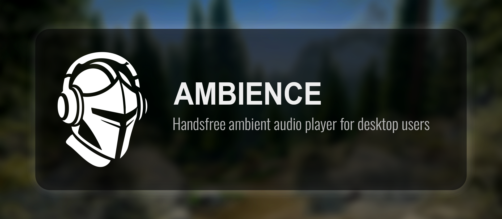

A Skyrim-themed ambient music player with auto-ducking. Built with Electron.


## Features

- **Category-based music organization** with custom folder icons
- **Auto-ducking** — automatically lowers volume when other audio plays
  - Device mode: monitor specific audio devices
  - Program mode: monitor specific apps (Discord, games, etc.)
- **Video backgrounds** for atmosphere
- **Start with Windows** option
- **Persistent settings** — window position, volume, preferences saved

## Installation

Download the latest installer from [Releases](https://github.com/CalvFletch/AmbienceApp/releases), or run from source:

```bash
git clone https://github.com/CalvFletch/AmbienceApp.git
cd AmbienceApp
npm install
npm start
```

## Music Setup

Point the app to your music folder in Settings. Organize tracks into category folders:

```
Music/
  Skyrim/
    icon.png      <- optional category icon
    Secunda.mp3
  Oblivion/
    icon.png
    Harvest Dawn.mp3
```

## Requirements

- Windows 10+
- .NET Framework 4.0 (for audio detection)

## License

ISC
