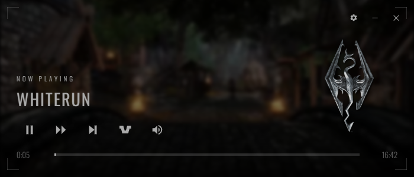

# Ambience App

A Skyrim-themed ambient music player with intelligent auto-ducking capabilities. Built with Electron.



## Features

- **Ambient Music Player**: Play ambient music tracks from a customizable music folder
- **Category Support**: Organize music into categories with custom icons
- **Auto-Ducking**: Automatically lowers music volume when other audio is detected
  - **Device Mode**: Duck against specific audio devices
  - **Program Mode**: Duck against specific applications (e.g., Discord, games)
- **Skyrim-Themed UI**: Immersive interface with themed decorations and styling
- **Video Backgrounds**: Optional video backgrounds for enhanced atmosphere
- **Persistent Settings**: Window position, volume, and preferences are saved
- **Start with Windows**: Optional auto-start on system boot
- **Frameless Window**: Custom window controls with transparency

## Installation

### From Release (Recommended)

1. Download the latest setup executable from the [Releases](https://github.com/CalvFletch/AmbienceApp/releases) page
2. Run the installer
3. Launch Ambience from the Start Menu or desktop shortcut

### From Source

```bash
# Clone the repository
git clone https://github.com/CalvFletch/AmbienceApp.git
cd AmbienceApp

# Install dependencies
npm install

# Run the app
npm start

# Build the installer
npm run build
```

## Usage

### Setting Up Your Music

1. Click the settings icon (gear) in the top-right corner
2. Click "Select Folder" to choose your music directory
3. Organize your music into folders (each folder becomes a category)
4. Add an `icon.png` file to the top-level category folders for custom icons

Example folder structure:
```
Music/
  Skyrim/
    icon.png
    Secunda.mp3
    Aurora.mp3
  Oblivion/
    icon.png
    Harvest Dawn.mp3
```

### Auto-Ducking

**Device Mode**: Duck music when specific audio devices are playing
1. Go to Settings > Duck Mode > Device
2. Click "Select Devices"
3. Choose which audio devices to monitor

**Program Mode**: Duck music when specific programs are playing audio
1. Go to Settings > Duck Mode > Program
2. Click "+ Add Program"
3. Select executable files to monitor

### Keyboard Shortcuts

- **Ctrl+D**: Toggle debug log

## Controls

- **Play/Pause**: Start or pause playback
- **+5 Minutes**: Jump forward 5 minutes in the current track
- **Skip**: Skip to the next track
- **Duck Button**: Toggle auto-duck on/off
- **Volume**: Adjust playback volume
- **Track Section**: Click to view all tracks and categories

## Requirements

- Windows 10 or later
- .NET Framework 4.0 (for audio detection)

## Development

### Prerequisites

- Node.js 18 or later
- npm

### Project Structure

- `main.js` - Electron main process
- `renderer.js` - UI logic and controls
- `preload.js` - IPC bridge for main window
- `devices-preload.js` - IPC bridge for device selection window
- `index.html` - Main UI layout
- `styles.css` - Skyrim-themed styling

### Building

The app uses electron-builder for packaging:

```bash
npm run build
```

Output will be in the `dist/` directory.

## Technical Details

### Auto-Ducking Implementation

The app uses a compiled C# helper utility to access Windows Core Audio APIs:
- Monitors audio peak levels on selected devices
- Tracks active audio sessions per process
- Real-time audio detection with minimal latency

### Supported Audio Formats

- MP3
- WAV
- OGG
- FLAC
- M4A
- AAC
- MP4
- WebM
- MKV

## License

ISC

## Credits

Inspired by the ambient soundtracks of The Elder Scrolls series.
